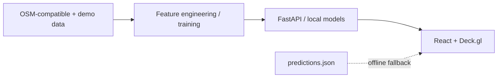

# BlackSpot

> **Predicting where India's next fatal road accident will happen — before it does.**


BlackSpot is a predictive road-accident hotspot engine for Delhi. It evaluates road geometry, infrastructure, crash patterns, and environmental conditions to surface dangerous segments, then lets policy teams simulate safety interventions. The deployed application uses no runtime LLM or AI API calls.

## AI-assisted development

BlackSpot was primarily built with **OpenAI Codex** for planning, implementation, debugging, refactoring, code review, test design, and documentation. Codex was used during development only: the deployed application makes no runtime OpenAI, Codex, LLM, or generative-AI API calls. All risk intelligence is produced locally with deterministic GIS-style feature engineering and classical machine-learning models.

## Key features

- 3D Deck.gl risk hexagons, coloured road paths, and crash markers over Mapbox dark-v11
- 25 engineered risk features with local Random Forest model serving
- Rain, fog, night, and festival scenario simulation
- Click-through explainability and a local What-If intervention engine
- Static `predictions.json` fallback: the frontend remains usable when the API is offline

## Architecture



## Tech stack

| Layer | Technology |
|---|---|
| UI | React 18, TypeScript, Vite, vanilla CSS |
| Mapping | Deck.gl, Mapbox GL JS / react-map-gl |
| Charts | Recharts |
| API | FastAPI, Uvicorn |
| ML | scikit-learn Random Forest; optional XGBoost/SHAP dependencies |
| Data | Pandas, NumPy, Geo-ready CSV/JSON |

## Getting started

```bash
cd ml
python generate_demo_data.py
python train_model.py

cd ../backend
python -m pip install -r requirements.txt
uvicorn main:app --reload
```

In a second terminal:

```bash
cd frontend
npm install
npm run dev
```

Set `VITE_API_URL=http://localhost:8000` and `VITE_MAPBOX_TOKEN=<your Mapbox public token>` for the live basemap. If the API does not respond, static predictions load automatically.

## API

| Endpoint | Purpose |
|---|---|
| `GET /api/health` | Model/data readiness |
| `GET /api/segments` / `GET /api/segments/{id}` | Segment map data and detail |
| `POST /api/risk/predict` / `batch` | Condition-aware risk scores |
| `POST /api/simulate/whatif` | Safety intervention impact |
| `GET /api/summary`, `/api/shap/{id}` | City summary and explainability |

## Data and ML

The included generator creates 3,500 realistic synthetic Delhi road segments and 2,800 synthetic accidents with a fixed seed. Training derives crashes per segment, learns a balanced high-risk classifier, serializes the models, and exports frontend-safe predictions. See [architecture](docs/ARCHITECTURE.md) and [data sources](docs/DATA_SOURCES.md).

## Roadmap

Integrate live OSM extracts, road authority crash records, IMD weather feeds, ward-level intervention planning, and calibrated model monitoring.

## Team

BlackSpot team — product, geospatial ML, and frontend engineering.

MIT licensed. See [Codex development log](docs/CODEX_USAGE.md) and [demo script](docs/DEMO_SCRIPT.md).
