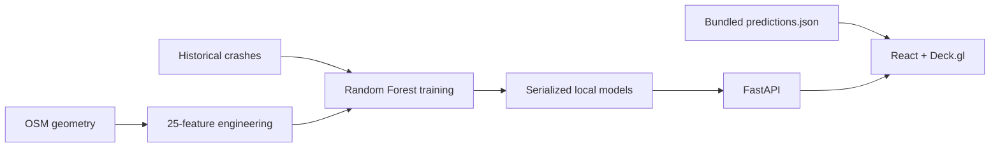

# Architecture

The browser renders Mapbox dark-v11 through `react-map-gl`; Deck.gl overlays extruded 200 m risk hexagons, coloured road paths, and crash markers. FastAPI loads CSV/JSON data and serialized scikit-learn models once at startup. If the API is unavailable, the UI uses its bundled prediction file and preserves all visual scenario changes.

## Component hierarchy

`App → Header, MapView (HexagonLayer, PathLayer, ScatterplotLayer), RiskSummaryPanel | SegmentDetailPanel, ConditionToggle`.

## Deployment

Vercel builds the static Vite app. Render builds the Python 3.11 Docker image and exposes Uvicorn on port 8000. The frontend receives its backend origin via `VITE_API_URL` and an optional Mapbox token via `VITE_MAPBOX_TOKEN`.
